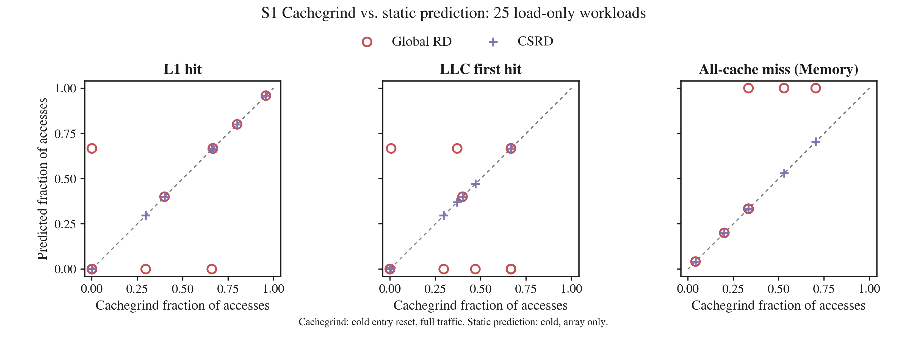

# S1 Cachegrind cold-start 재비교

2026-09-20. **배열 초기화 후 `chaser_s1`의 첫 명령 실행 직전에 Cachegrind의
I1·D1·LL cache 상태를 비우고 동일 ELF 25개를 다시 실행했다.**
모든 실행에서 정확히 한 번의 reset을 확인했으며, 배열 load count와 checksum 검사를 통과했다.
**25/25에서 Cachegrind와 CSRD의 `[L1, LLC, Memory]` count가 일치했다.**



x축은 **Cachegrind의 cache simulation 결과**, y축은 **YARDA 정적 예측**이다.
Python LRU를 x축 계산에 사용하지 않았다. Hardware counter 실측 결과는 아니다.

## 이전 실험과 달라진 조건

| 항목 | 기존 cachegrind-v1 | 이번 cold 재실험 |
|---|---|---|
| 입력 | host-trace-v2의 C·ELF·정적 분석 결과 | 동일 입력, 재빌드 없음 |
| 함수 시작 cache 상태 | 프로그램 시작·초기화가 만든 상태 | 첫 명령 직전에 I1·D1·LL reset |
| Cachegrind | 설치된 stock 3.18.1 | 공식 3.18.1에 entry reset만 추가한 별도 빌드 |
| Cache 갱신 | 전체 traffic | 전체 traffic 유지 |
| 집계 | 배열 load 소스 줄의 data read | 동일 |
| CSRD와 count 일치 | 0/25 | 25/25 |

I1·D1은 각각 16 KiB, LL은 2 MiB이며 모두 32-byte line·4-way다.
YARDA L1/LLC geometry도 D1/LL과 같다. 분석 함수의 반복은 기존 3 sweep 그대로다.
초기화가 저장한 배열 값은 유지하므로 계산·checksum은 바뀌지 않는다.

패치는 guest PC가 ELF의 `chaser_s1` symbol 시작 주소에 도달할 때 runtime helper를 실행한다.
이전 buffered event를 먼저 처리하고 현재 명령의 cache 접근 전에 tag 배열을 0으로 만든다.
이는 원본 Cachegrind의 cache 생성 시 상태와 같다. **Cache lookup·LRU replacement·miss 계산
코드는 수정하지 않았고, 통계 counter도 초기화하지 않았다.**
전체 프로그램 counter는 과거 초기화를 포함하므로 결과 비교에는 분석 함수의 배열 load 줄만 선택한다.

[패치](s1-cold-entry.patch), [빌드 출처](s1-build.json),
[빌드·재현 설명](../../../tools/cachegrind/README.md)을 보존했다.
공식 릴리스 archive·패치·cache simulator 소스·실행 도구의 해시가 기록돼 있다.
Stock Cachegrind가 원래 이 reset 옵션을 제공하는 것은 아니다.

## 결과

| Workload | 기존 초기화 후 Cachegrind | Cold reset Cachegrind | Cold CSRD |
|---|---|---|---|
| `packed_8` | `[24,0,0]` | `[23,0,1]` | `[23,0,1]` |
| `conflict_5` | `[0,15,0]` | `[0,10,5]` | `[0,10,5]` |
| `capacity_512` | `[1532,4,0]` | `[1024,0,512]` | `[1024,0,512]` |
| `capacity_65537` | `[0,196584,27]` | `[0,131064,65547]` | `[0,131064,65547]` |
| `mean_uniform` | `[4092,1024,0]` | `[4092,0,1024]` | `[4092,0,1024]` |

`conflict_5`는 처음 5개 line이 비어 있는 cache에서 시작하므로 memory miss 5회,
이후 10회는 L1 충돌 miss·LL hit가 된다. 기존 `[0,15,0]`과의 차이가 cold reset으로 해소됐다.

| 모델 | L1 비율 MAE | LLC 비율 MAE | Memory 비율 MAE |
|---|---:|---:|---:|
| Global RD | 0.091592 | 0.148932 | 0.057340 |
| CSRD | 0 | 0 | 0 |

25개 workload에 동일 가중치를 주었다. 모든 비율은 선택된 전체 배열 load를 분모로 하며,
`[Dr-D1mr, D1mr-DLmr, DLmr] / Dr`로 계산했다. Raw counter도 함께 보존한다.

## reset 검증과 해석 범위

- 매 case의 reset 로그 주소가 `nm`의 함수 시작 주소와 같은지, 발생 횟수가 정확히 1인지 검사했다.
- 동일 patched binary에서 **reset 옵션을 끈 대조 실행**도 25개 수행했다.
  배열 count는 기존 stock Cachegrind 결과와 25/25 일치했다.
  [no-reset-control/suite.json](no-reset-control/suite.json)에 명령·count와 원본 해시가 있다.
- 작은 함수를 2번 호출하는 별도 검증에서는 매번 reset되어 I1·LL instruction miss가
  각각 2회 발생하고, data load와 return stack read도 다시 cold miss가 되는 것을 확인했다.
  이 2회 reset 로그는 단일 호출 S1 runner에서 의도적으로 거부한다.

**이번 변경은 cold 시작 상태를 맞추는 실험이다. 배열 주소 필터를 cache 갱신 전에 넣은 것은 아니다.**
함수 실행 중 instruction·stack·다른 접근은 Cachegrind의 cache 상태에 계속 영향을 준다.
현재 통제된 25개 load-only workload에서는 선택 배열 count가 모두 일치했지만,
그 사실이 임의 프로그램에서도 전체 traffic 영향이 없음을 뜻하지 않는다.
소스 줄별 집계는 일반적인 배열 주소 범위 필터와 동등하지 않다.
GR740/SPARC 실행 cache counter·실행 시간·scheduling 검증도 포함하지 않는다.

## 재현과 증거

```sh
python3 -m tools.run_s1_cachegrind --input rtems/s1/build/host-trace-v2 \
  --output rtems/s1/build/cachegrind-cold-new --cold-prefix /tmp/chaser-cg-cold-install
MPLCONFIGDIR=/tmp/chaser-matplotlib python3 -m tools.plot_s1 \
  rtems/s1/build/cachegrind-cold-new/suite.json --output /tmp/s1-cold-plots-new
CHASER_COLD_PREFIX=/tmp/chaser-cg-cold-install sh scripts/verify
```

반드시 새 output 경로를 쓴다. 별도 도구 설치가 필요하며 `--cold-prefix`를 생략하면 기존
초기화 후 비교가 실행된다. 전체 보고서는 [suite.json](suite.json), count 표는
[results.csv](results.csv), 그림은 [SVG](prediction-reference.svg)·[PNG](prediction-reference.png)다.
[manifest.json](manifest.json)은 이 증거 묶음의 SHA-256이다.

Case별 `cachegrind.out.gz`는 Cachegrind 원본 출력, `trace.log.gz`는 reset·진단 로그,
`stdout.txt`는 checksum, `symbols.txt`는 ELF symbol, `capture.json`은 실행 명령이다.
비압축 원본은 `rtems/s1/build/cachegrind-cold-v2`에 보존하며 Git에서 제외한다.
기존 초기화 후 [cachegrind-v1](../cachegrind-v1/README.md) 결과는 변경하지 않았다.
