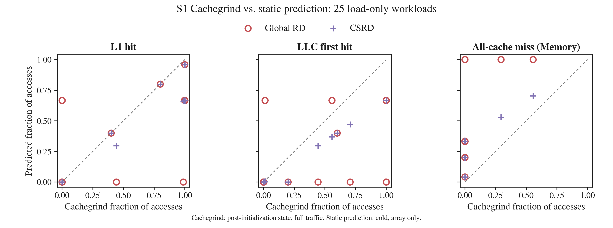

# S1 Cachegrind 비교

2026-09-20. **Stock Cachegrind 3.18.1로 기존 host ELF 25개를 실행하고,
YARDA의 Global RD·CSRD 예측과 비교했다.** 실행·checksum·선택 load 수 검증은
25/25 성공했다. CSRD와 Cachegrind의 계층별 count가 완전히 같은 사례는 0/25였다.



이 그림의 **x축은 Cachegrind가 계산한 cache 결과**, y축은 **YARDA 정적 분석의
Global RD·CSRD 예측**이다. x축 생성에 Python LRU를 사용하지 않았다.
Cachegrind 역시 실행에 기반한 cache simulation이며 hardware counter 실측은 아니다.

## 비교 조건

| 항목 | Cachegrind x축 | YARDA y축 |
|---|---|---|
| ELF | host-trace-v2에서 실행·분석한 동일 x86-64 ELF | 같은 ELF의 linked 주소와 동일 C에서 추출한 APE |
| D1/L1 | 16 KiB, 4-way, 32-byte line | 동일 |
| LL/LLC | 2 MiB, 4-way, 32-byte line | 동일 |
| Instruction cache | I1 16 KiB, 4-way, 32-byte line; instruction/data가 LL 공유 | Instruction traffic 없음 |
| 분석 함수 시작 상태 | 프로그램 시작·배열 초기화를 거친 상태 | Cold |
| Cache 상태에 영향을 주는 접근 | 초기화·stack·기타 data·instruction 포함 | 분석 대상 배열만 |
| 집계 대상 | `chaser_s1`의 배열 load 소스 줄에 귀속된 data read | 해당 배열의 load |

기존 [host trace 평가](../host-trace-v1/README.md)와 달리, 이번에는 **필터링 전에
Cachegrind가 전체 traffic으로 cache 상태를 갱신**한다. 이후 출력에서 함수명·소스 파일·
배열 load 줄 번호로 count를 선택한다. 초기화와 다른 접근의 영향은 제거하지 않는다.

설치된 3.18.1에는 최신 버전의 Cachegrind 시작/중지 client request가 없다.
이번 비교는 설치된 stock 도구를 그대로 사용한다. 함수 시작에 cache를 비웠다고 주장하지 않는다.

각 소스의 `sum += data[...]` 줄을 선택하고, `Dr`가 기존 검증의 배열 load 수와
정확히 같은지, `Dw=0`인지 확인했다. 함수 전체 count와 프로그램 전체 summary도 보존했다.
최적화된 임의 프로그램에서는 source-line attribution이 배열 주소 필터와 동등하지 않을 수 있다.
이 선택 방식은 현재 생성된 1-byte load-only workload에 한정한다.

선택된 소스 줄의 합계에서 다음과 같이 계산한다.

- L1 hit count = `Dr - D1mr`
- LLC first hit count = `D1mr - DLmr`
- All-cache miss count = `DLmr`
- 각 비율의 분모 = `Dr`

선택 count 불일치·checksum 오류·기존 ELF/분석 산출물 변조·도구 실패는 평가 실패로 기록한다.
예측과 Cachegrind의 차이는 측정 결과로 남기며 실행 실패로 처리하지 않는다.

## 결과와 해석

| Workload | Cachegrind `[L1, LL, Memory]` | Cold CSRD `[L1, LLC, Memory]` |
|---|---|---|
| `packed_8` | `[24, 0, 0]` | `[23, 0, 1]` |
| `conflict_5` | `[0, 15, 0]` | `[0, 10, 5]` |
| `capacity_512` | `[1532, 4, 0]` | `[1024, 0, 512]` |
| `capacity_65537` | `[0, 196584, 27]` | `[0, 131064, 65547]` |
| `mean_uniform` | `[4092, 1024, 0]` | `[4092, 0, 1024]` |

`packed_8`은 초기화로 배열이 이미 cache에 있어 24회 모두 hit한다.
`conflict_5`의 L1 충돌은 그대로지만 초기화로 LL에 배열이 남아 있어 15회 모두 LL hit다.
용량 경계의 추가 miss에는 다른 data 및 instruction traffic의 영향도 포함될 수 있다.
이 비교만으로 개별 추가 miss의 원인을 특정하지는 않는다.

| 모델 | L1 비율 MAE | LLC 비율 MAE | Memory 비율 MAE |
|---|---:|---:|---:|
| Global RD | 0.245316 | 0.279411 | 0.357011 |
| CSRD | 0.153724 | 0.145947 | 0.299671 |

25개 workload에 동일 가중치를 주었다. **이 MAE는 조건이 다른 두 경로 사이의 차이**다.
초기 상태와 traffic을 맞춘 상태에서 정적 분석기 자체의 정확도를 측정한 오차로 해석하면 안 된다.
기존 모델 일치 결과와 이번 Cachegrind 결과를 함께 보고, warm state·모델 범위 차이를 구분한다.
동일 조건의 외부 simulator 검증을 위해서는 별도의 cold 초기 상태와 입력 traffic 통제가 필요하다.

## 재현과 증거

기존 host suite를 생성한 뒤 새 output 디렉터리로 실행한다.

```sh
python3 -m tools.run_s1_cachegrind \
  --input rtems/s1/build/host-trace-v2 \
  --output rtems/s1/build/cachegrind-new --timeout 120
MPLCONFIGDIR=/tmp/chaser-matplotlib python3 -m tools.plot_s1 \
  rtems/s1/build/cachegrind-new/suite.json --output /tmp/s1-cachegrind-plots-new
```

실제 Cachegrind 옵션은 다음과 같으며 정확한 ELF·출력 경로는 case별 `capture.json`에 있다.

```text
--command-line-only=yes --tool=cachegrind --cache-sim=yes --branch-sim=no
--I1=16384,4,32 --D1=16384,4,32 --LL=2097152,4,32 --error-exitcode=97 --log-fd=2
```

[results.csv](results.csv)는 전체 count 표, [suite.json](suite.json)은 함수·프로그램·선택 줄
통계와 예측·오차·입력 해시를 담는다. [manifest.json](manifest.json)은 이 묶음의 해시다.
각 case 디렉터리에 Cachegrind 원본 `cachegrind.out.gz`, stderr `trace.log.gz`, checksum
`stdout.txt`, 명령 `capture.json`, 비교 `comparison.json`을 함께 보존했다.
`trace.log.gz`는 이번에는 Cachegrind의 진단/요약 로그이며 Lackey 주소 trace가 아니다.
ELF·소스·YARDA 원본은 `rtems/s1/build/host-trace-v2`, 비압축 Cachegrind 출력은
`rtems/s1/build/cachegrind-v1`에 있다. 두 raw 디렉터리는 Git에서 제외된다.
