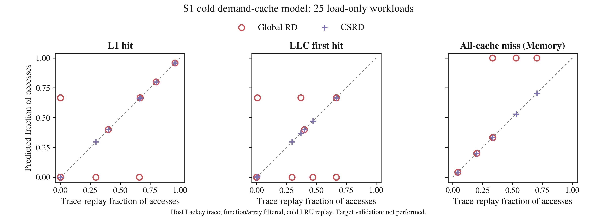

# S1 실행 trace 기반 검증

실험: 2026-09-20. **전체 25개 workload의 1,324,424개 배열 접근에서 실행 주소열과
YARDA 주소열이 순서·주소·크기·load/store까지 일치했다.** 필터링된 실행 trace를
cold LRU로 재생한 계층별 count도 25개 모두 CSRD와 일치했다.

이 검증은 **host x86-64에서 실행한 배열 접근**을 대상으로 한다.
GR740/SPARC 실행 trace, hardware cache counter 또는 실행 시간을 측정한 결과는 아니다.



## 무엇을 독립적으로 검증했나?

기존 [모델 평가 그래프](../model-v1/README.md)는 YARDA가 생성한 주소열을 Python
LRU로 재생했다. Cache 판정은 독립적이지만, 잘못된 APE expansion이나 주소열을
두 경로가 공유할 가능성이 있었다.

이번에는 같은 생성 C에서 다음 두 경로를 만들었다.

1. **실행 경로:** Clang으로 host ELF를 빌드 → Valgrind Lackey로 실행하며
   instruction PC와 메모리 접근 주소·크기·종류를 기록 → 함수·배열 범위 필터링.
2. **분석 경로:** Clang/opt로 같은 C의 APE 추출 → **실행한 바로 그 host ELF**를
   YARDA에 전달 → source-access 순서의 `(operation, linked_address, access_size)` 추출.

먼저 두 주소열 전체를 비교하고, 그다음 **실행 경로의 주소열**로 Python LRU를 재생한다.
YARDA의 hit/miss·set/tag 판정은 replay 입력으로 쓰지 않는다.
최종 cache count가 같더라도 byte 주소·순서·load/store·크기가 다르면 불일치다.
`sequence` 항목에는 접근 수, 두 SHA-256, 첫 불일치 위치가 기록된다.

## Cachegrind 전체 통계를 쓰지 않은 이유

[Valgrind Lackey](https://valgrind.org/docs/manual/lk-manual.html)의 `--trace-mem=yes`로
주소 trace를 수집한다. Cachegrind의 최종 hit/miss 합계를 가져오는 방식이 아니다.

- 가장 최근 instruction PC가 ELF의 `chaser_s1` 함수 범위 안인 접근만 선택한다.
- 그중 ELF의 `data` 배열 byte 범위에 완전히 포함되는 접근만 선택한다.
- 초기화, checksum, instruction fetch, stack, 다른 객체 접근은 **cache 재생 전에** 제외한다.
- `M` 기록은 load와 store로 확장한다. 현재 25개 workload의 선택 결과는 모두 1-byte load다.
- 함수 1회 진입·종료를 요구한다. 이 경로는 생성된 leaf 함수에 한정하며,
  다른 함수 호출 후 재진입하는 임의의 프로그램에는 그대로 적용하지 않는다.

따라서 stack 접근이 배열 line을 쫓아낸 뒤 count만 제거하는 문제가 없다.
대신 **전체 프로그램의 실제 cache 간섭과 초기화 후 warm state는 평가하지 않는다.**
초기화는 실행되지만 replay cache는 비어 있는 상태에서 시작한다.

## 조건과 결과 해석

Workload 시나리오는 [기존 25-case 설명](../model-v1/README.md#3-25개-workload의-실험-시나리오)과 같다.
Packed, spread/conflict의 4-way 경계, L1·LLC 용량 경계, 같은 mean RD의 histogram 쌍을 포함한다.

| 항목 | 설정 |
|---|---|
| 실행 ELF | x86-64 ELF64, non-PIE ET_EXEC, unstripped |
| Host 컴파일 | Clang 14, `-O1 -gdwarf-4 -fno-pie -no-pie` |
| APE 추출 | 같은 생성 C, Clang 14 `-O0`, mem2reg·loop-simplify·loop-annotated-trace |
| Trace 수집 | Valgrind Lackey 3.18.1, 명령행 옵션만 적용 |
| 주소 범위 | GNU nm의 `chaser_s1`·`data` symbol 주소/크기 |
| L1 / LLC | 16 KiB / 2 MiB, 모두 32-byte line·4-way·LRU |
| Cache 모델 | Cold, 모든 demand miss 할당, LLC에는 L1 miss만 전달, back invalidation 없음 |
| 반복 | 기본 3 sweep; histogram 쌍은 기존 phase 구조 유지 |
| 실행 확인 | Native 실행과 Lackey 실행 각각 checksum 확인 |

DWARF 4는 설치된 Valgrind와 디버그 정보 형식을 맞추기 위한 설정이다.
Linked host 배열 주소를 실행에서도 확인하므로 기존 SPARC ELF 주소를 host trace와 혼용하지 않는다.

| 대표 workload | 실행 trace 재생 `[L1 hit, LLC first hit, all-cache miss]` |
|---|---|
| `packed_8` | `[23, 0, 1]` |
| `conflict_4` | `[8, 0, 4]` |
| `conflict_5` | `[0, 10, 5]` |
| `capacity_513` | `[1016, 10, 513]` |
| `capacity_65537` | `[0, 131064, 65547]` |
| `mean_uniform` | `[4092, 0, 1024]` |
| `mean_mixed` | `[2046, 2046, 1024]` |

그래프 x축은 **실행 trace를 필터링해 cold LRU 모델로 재생한 비율**이다.
측정한 hardware hit rate 자체는 아니다. y축은 Global RD·CSRD의 예측 비율이다.
모든 비율의 분모는 전체 선택된 cache-line 접근 수이며 세 패널의 합은 1이다.
대각선은 일치, 위쪽은 과대예측, 아래쪽은 과소예측을 뜻한다. 겹치는 점은 유지했다.

| 모델 | L1 비율 MAE | LLC 비율 MAE | Memory 비율 MAE |
|---|---:|---:|---:|
| Global RD | 0.091592 | 0.148932 | 0.057340 |
| CSRD | 0 | 0 | 0 |

25개 workload에 같은 가중치를 주었다. 기존 모델 평가와 모든 count·좌표가 같지만,
이번 x축은 독립 실행에서 얻은 주소열로 계산했다는 점이 다르다.
Global RD는 full-stream capacity bins를 사용하며, LLC recency 가정 차이도 오차에 포함될 수 있다.

이 결과는 **통제된 host workload에서 YARDA의 주소열과 같은 모델의 cache 판정이
실행 trace와 부합함**을 뒷받침한다. 임의 프로그램 전체, SPARC 컴파일 결과,
GR740의 실제 replacement·prefetch·instruction/data 간섭 또는 성능 향상으로 일반화하지 않는다.

## 재현과 증거

```sh
sh scripts/verify
python3 -m tools.run_s1_execution --output rtems/s1/build/host-trace-new \
  --sweeps 3 --max-references 250000 --timeout 120 --max-trace-bytes 536870912
MPLCONFIGDIR=/tmp/chaser-matplotlib python3 -m tools.plot_s1 \
  rtems/s1/build/host-trace-new/suite.json --output /tmp/s1-host-trace-plots-new
```

반드시 새 output 경로를 사용한다. 작은 pilot에는
`--cases packed_8 conflict_5 capacity_513`을 추가한다.
Timeout은 외부 명령마다 적용하고, trace 출력 한도는 stdout·stderr의 합산 비압축 byte 수다.
실패·불완전 trace·checksum 오류·한도 초과를 기록하고 다음 case를 시도한다.
한 case라도 실패/불일치하면 suite는 실패다. Global RD의 예측 오차는 실험 결과이므로
그 자체를 suite 실패로 처리하지 않는다.

| 증거 | 내용 |
|---|---|
| [suite.json](suite.json) | Case별 주소열 비교·필터 통계·count·오차·원본 해시 |
| [results.csv](results.csv) | 전체 25개 case의 접근 수·count·제외 접근 수 |
| [inputs.json](inputs.json) | 생성 설정·도구 버전·실행 파일/구현 해시·한도 |
| [resources.json](resources.json) | 운영 wall time·저장량; 성능 측정으로 사용하지 않음 |
| [manifest.json](manifest.json) | 이 요약 묶음의 SHA-256과 원본 위치 |
| [prediction-reference.svg](prediction-reference.svg) | 논문 편집용 벡터 그래프 |

원본은 Git에서 제외된 `rtems/s1/build/host-trace-v2`에 보존한다.
각 case에는 source/LLVM/APE/ELF, 명령·checksum 로그, 전체 `trace.log.gz`,
선택된 `(operation,address,size)`의 `accesses.jsonl.gz`, YARDA 분석·events가 있다.
요약 묶음만으로 원본 trace를 재검사할 수는 없으므로 재검사에는 원본 또는 재실행이 필요하다.
Nested `comparison/comparison.json`은 기존 model-only evaluator의 내부 보고서이며,
실행 검증 결과의 정본은 바깥쪽 `execution.json`과 이 `suite.json`이다.
