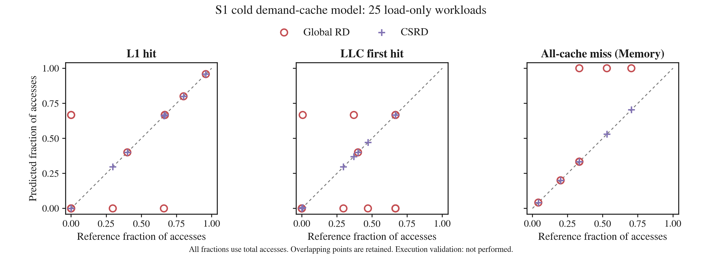

# S1 load-only 모델 평가

실험: 2026-09-19 · 한국어 설명 갱신: 2026-09-20

**25개 workload 모두에서 CSRD와 독립 reference의 계층별 count가 일치했고,
실패는 0건, 모델에 포함된 소스 접근의 coverage는 100%였다.**
이 결과는 통제된 S1 workload의 추상 cache 모델 평가다.
실제 target의 cache trace/counter 검증은 아직 수행하지 않았다.



## 1. 계층별 접근 비율은 무엇인가?

그래프의 `fraction of accesses`는 **전체 cache-line 접근 중 해당 조건에 속한
접근의 비율**이다. L1 → LLC → Memory 순서로 찾았을 때 어느 계층에서
처리됐는지를 세며, 한 접근은 한 계층에만 속한다. LLC의 “first hit”는
L1 miss 이후 LLC에서 처음 hit했다는 뜻이며, 시간상 첫 접근을 뜻하지 않는다.

전체 분석 접근 수를 N이라고 하면 다음과 같다.

| 그래프 패널 | 비율의 정의 | 뜻 |
|---|---|---|
| L1 hit | L1 hit 수 / N | L1에서 바로 처리한 접근 |
| LLC first hit | L1 miss 후 LLC hit 수 / N | L1에는 없지만 LLC에서 처리한 접근 |
| All-cache miss (Memory) | L1·LLC 모두 miss인 수 / N | 두 cache에서 찾지 못해 memory까지 내려간 접근 |

이 세 값의 합은 1이며, `[L1, LLC, Memory]` 순서의 벡터가 이 실험의 CLP다.
Memory 비율은 all-cache miss ratio와 같다. 이 실험은 1-byte load만 사용하므로
각 소스 load가 하나의 cache-line 접근에 대응한다.

예를 들어 100번 접근 중 L1 hit 60번, LLC hit 30번, memory 접근 10번이면
CLP는 `[0.6, 0.3, 0.1]`이다. **LLC first-hit ratio는 30/100=0.3**이다.
LLC에 도달한 40번만 분모로 삼는 LLC local hit rate인 30/40=0.75와 구분한다.

이 비율은 접근 횟수의 비율이다. 실행 시간 비중이나 성능 향상률을 뜻하지 않는다.
Cold 접근도 분모에 포함하며, 비어 있는 두 cache에 처음 들어오는 line은
Memory로 분류한다. 따라서 cache에 잘 들어맞는 workload도 이 실험에서는
Memory 비율이 0보다 클 수 있다.

## 2. 실험 조건과 비교 방법

각 workload를 서로 독립적인 cold cache 상태에서 분석한다.
서로 다른 workload 사이의 cache 상태는 공유하지 않는다.
한 번에 하나의 workload를 분석하며, task 간 동시 실행이나 scheduling은 이 그래프의 대상이 아니다.

| 항목 | 설정 |
|---|---|
| L1 | 16 KiB, 32-byte line, 4-way, 128 sets |
| LLC | 2 MiB, 32-byte line, 4-way, 16,384 sets |
| Replacement | 두 계층 모두 LRU |
| LLC 입력 | L1 miss만 전달하는 demand 모델 |
| Allocation | 모든 demand miss에서 line 할당 |
| 계층 관계 | 독립 상태; back invalidation·victim insertion 없음 |
| 분석 대상 | 생성 C 함수 안의 volatile 배열 load |
| 분석 제외 | 초기화, checksum 확인, instruction·stack 접근, prefetch·writeback traffic |
| 반복 | 일반 cyclic workload는 같은 접근 순서를 3 sweep |

3 sweep은 한 분석 stream 안의 반복이며, 세 번의 독립 target 실행이 아니다.
각 sweep마다 cache를 비우지 않는다. 별도 warm-up을 제거하지 않고 첫 sweep의
cold 접근까지 집계한다. 동일 mean RD 쌍은 아래에 설명한 별도 phase 구조를 쓴다.

각 case의 **동일한 생성 C 소스에서 LLVM/APE와 SPARC ELF를 빌드**한다.
추출한 APE의 loop bound는 나중에 고치지 않는다. Linked 주소 순서, load 여부,
alignment, 접근 수와 coverage를 검사한 뒤 다음 경로를 비교한다.

| 경로 | 역할 |
|---|---|
| Element Global RD | 원소 단위 RD·CA를 수집하여 기존 CAAS 표현과 비교 |
| Cache-line Global RD | 전체 linked line stream의 RD histogram으로 계층별 비율 예측 |
| CSRD | Set별 RD와 L1 miss의 하위 계층 전달을 반영해 비율 예측 |
| 독립 reference | 같은 linked 주소 stream을 Python resident-LRU cache로 재생 |

RD/CSRD 계산은 모두 C++ YARDA가 수행한다. Python reference는 RD를 계산하지 않고
set별 cache에 어떤 line이 남아 있는지 직접 관리한다.

**x축 생성에는 Cachegrind를 사용하지 않았다.** 구현은
[`chaser/cache_reference.py::simulate`](../../../chaser/cache_reference.py)에 있다.
YARDA가 APE와 linked ELF로 만든 주소 stream을 받아, set별 `OrderedDict`에
resident line을 저장하고 hit·LRU 갱신·eviction을 직접 수행한다.
L1 miss만 LLC에 전달하고, `[L1 hit, LLC first hit, all-cache miss]` count를
전체 접근 수로 나눈 결과가 x축이다. YARDA의 RD·CSRD·hit/miss 판정을 재사용하지 않는다.

따라서 x축은 **같은 입력 stream·cache 모델에 대한 독립 reference 결과**다.
실제 실행에서 수집한 trace나 hardware counter에 근거한 ground truth는 아니다.
Cache 판정 구현의 독립성과 입력 주소 stream의 독립성은 구분한다.

Global RD 대조군의 규칙은 `full-linked-stream-capacity-bins-v1`이다.
전체 linked stream의 cache-line RD를 다음과 같이 분류한다.

| 조건 | Global RD의 예측 |
|---|---|
| RD < 512 | L1 |
| 512 ≤ RD < 65,536 | LLC |
| RD ≥ 65,536 또는 cold | Memory |

두 경계에 같은 전체 stream의 RD를 사용한다. 실제 geometry를 사용하는 CSRD와
reference의 LLC는 L1 miss만 보므로, **2계층 오차 차이에는 set 배치뿐 아니라
LLC recency stream 가정의 차이도 포함될 수 있다.**

## 3. 25개 workload의 실험 시나리오

| 구성 | 개수 | 접근 패턴과 확인할 내용 |
|---|---:|---|
| `packed_8` | 1 | 인접한 8개 byte를 읽어 한 cache line에 모으고 line 정규화 효과 확인 |
| `spread_d` / `conflict_d` | 8 | d=3,4,5,8에서 서로 다른 set에 분산하거나 같은 L1 set에 집중시켜 4-way 경계 확인 |
| `capacity_n` | 14 | 연속된 n개 line을 순환하며 L1·LLC 용량 경계 확인 |
| `mean_uniform` / `mean_mixed` | 2 | 평균 RD·접근 수·cold 수·footprint가 같은 두 histogram의 cache 결과 비교 |

### Packed / Spread / Conflict

세 layout은 논리적인 원소 접근 순서를 유지하고 byte stride를 바꾼다.
Packed는 1 B, spread는 32 B, conflict는 4096 B 간격이다.
4096 B는 L1의 `128 sets × 32 B`이므로 conflict의 각 line이 같은 L1 set에 매핑된다.

`packed_8`은 8개 원소를 3번 읽어 총 24번 접근한다. 첫 load만 cold이고 나머지
23번은 L1 hit여서 CLP가 `[23/24, 0, 1/24]`이다.
`spread_8`은 처음 8번이 cold이고 나머지 16번은 L1 hit여서 `[2/3, 0, 1/3]`이다.
`conflict_8`은 같은 L1 set에 8개 line을 순환시키므로 `[0, 2/3, 1/3]`이다.
실제로 읽는 cache-line footprint는 spread8과 conflict8 모두 256 B다.
Conflict는 전체 L1 용량 부족이 아니라 특정 set의 way 수 초과를 보여준다.

세 case의 element CA는 모두 0.125이지만 line CA는 각각 1, 0.125, 0.125다.
이 값은 [results.csv](results.csv)에 있으며 scatter의 축 자체는 CA가 아니다.
Packed의 line 정규화 효과와 spread/conflict의 set 배치 효과를 나누어 해석한다.

### Associativity 경계

4-way에서는 같은 set의 4개 line까지 유지할 수 있다.
3 sweep 기준 `conflict_4`의 count는 `[8,0,4]`, `conflict_5`는 `[0,10,5]`다.
5개 line을 순환시키면 다음에 쓸 line이 계속 쫓겨나 L1 hit가 사라진다.

### Capacity 경계

서로 다른 line 수 n은 다음과 같다. 각 line에서 1 byte를 읽으며 cache-line
footprint는 `n × 32 B`다.

```text
256, 448, 511, 512, 513, 576, 1024, 32768,
61440, 65535, 65536, 65537, 69632, 73728
```

8 KiB부터 2.25 MiB까지 포함하고, L1 512-line 및 LLC 65,536-line 경계에서
±1 line을 확인한다. **용량을 조금 넘으면 일부 set만 overfull이 된다.**
`capacity_513`의 count는 `[1016,10,513]`, `capacity_65537`은 `[0,131064,65547]`이다.
Global RD의 fully associative 용량 기준과 차이가 생기는 지점이다.

반대로 capacity256/448/511/512는 footprint와 CA가 서로 달라도 CLP가 모두
`[2/3,0,1/3]`이다. CA 변화가 항상 cache-level 결과 변화로 이어지지는 않는다.

### 동일 mean RD, 다른 histogram

두 case는 모두 1024개 line, 5116번 load, 1024번 cold, finite mean RD=511,
CA=1/512로 맞췄다. 여기서 finite mean은 cold를 제외한 재사용 거리의 평균이다.

- `mean_uniform`: 512-line cycle에서 4092번 재사용한 뒤 새 512개 line을 한 번씩 읽는다.
- `mean_mixed`: 한 line을 2047번 읽고, 나머지 1023-line cycle을 3번 읽는다.

| Case | Finite RD histogram `{거리: 횟수}` | Reference count `[L1, LLC, Memory]` |
|---|---|---|
| `mean_uniform` | `{511:4092}` | `[4092,0,1024]` |
| `mean_mixed` | `{0:2046,1022:2046}` | `[2046,2046,1024]` |

평균과 cold 비율이 같아도 계층별 결과는 다르다. 이는 RD histogram을 평균 기반
CA 하나로 줄일 때 잃는 정보를 보여준다. **이번 쌍에서는 전체 histogram을 쓰는
Global RD 대조군도 정확히 예측한다.** 따라서 이 쌍을 Global RD estimator 자체의
오차 사례로 해석하지 않는다.

기존 RMW workload의 증거는 `artifacts/baseline/rtems-v1`에 따로 보존하며,
이번 load-only 25개 결과의 통계에는 합치지 않았다.

## 4. 그래프를 읽는 방법

세 패널은 각각 L1, LLC, Memory 비율을 나타낸다.

- **x축 — Reference fraction of accesses:** 독립 LRU reference 모델이 계산한 비율.
  Cachegrind 또는 실제 하드웨어 측정값이 아니다.
- **y축 — Predicted fraction of accesses:** Global RD 또는 CSRD가 예측한 비율.
- **빨간 빈 원:** Global RD. **보라색 +:** CSRD.
- **회색 대각선 y=x:** 예측과 reference가 일치하는 위치.

한 workload는 패널마다 모델별로 한 점씩 만든다. 즉 각 패널에 모델당 25개 점이
있지만, 여러 workload의 좌표가 같으면 겹쳐 보인다. 원과 +가 같은 위치에
있으면 두 예측이 같은 것이다. 특정 workload의 정확한 좌표는 CSV에서 확인한다.

점이 대각선 위에 있으면 해당 계층의 비율을 과대예측하고, 아래에 있으면
과소예측한다. 좋은 예측은 대각선에 가까운 예측이다. 점이 높다고 더 좋은 것은
아니며, 비율의 절대오차는 `|y-x|`로 계산한다.

예를 들어 `conflict_5`는 전체 15번 중 처음 5번만 Memory로 가고,
나머지 10번은 L1 miss 후 LLC에서 처리된다.

| 모델 | L1 | LLC | Memory |
|---|---:|---:|---:|
| Reference | 0 | 2/3 | 1/3 |
| Global RD | 2/3 | 0 | 1/3 |
| CSRD | 0 | 2/3 | 1/3 |

Global RD는 재사용 RD=4가 L1 용량 512 lines보다 작다는 이유로 L1 hit를 예측한다.
CSRD는 같은 set의 RD=4가 4-way hit 조건인 `RD_set < 4`를 만족하지 않음을 반영한다.
따라서 빨간 점이 L1 패널에서는 `(0, 0.667)`, LLC에서는 `(0.667, 0)`에 놓인다.
Memory에서는 두 모델 모두 `(0.333, 0.333)`이다. CSRD의 점은 세 패널 모두 대각선에 있다.

전체 25개에서는 다음 오차를 얻었다.

| 모델 | L1 비율 MAE | LLC 비율 MAE | Memory 비율 MAE |
|---|---:|---:|---:|
| 전체 stream Global RD | 0.091592 | 0.148932 | 0.057340 |
| CSRD | 0 | 0 | 0 |

MAE는 workload마다 동일한 가중치를 준다. 예를 들어 L1 MAE 0.091592는 평균적으로
약 **9.16 percentage points**의 차이이며, 상대오차 9.16%를 뜻하지 않는다.
Global RD의 계층별 최대 절대오차는 0.666667 / 0.666667 / 0.666616,
CSRD는 모두 0이다. RMSE·cold 비율·histogram·개별 결과는 [suite.json](suite.json),
계층별 절대오차 표는 [results.csv](results.csv)에 있다.

이 그래프가 뒷받침하는 주장은 **통제된 접근 패턴과 같은 cache 모델 아래에서
CSRD가 set-associative residency를 반영한다**는 것이다. 충돌이 적거나 두 모델의
결과가 같은 조건에서는 Global RD도 reference와 일치한다.

## 5. 검증 범위와 한계

후속 [host 실행 trace 검증](../host-trace-v1/README.md)에서 같은 25개 workload의
배열 접근을 Lackey로 독립 수집하여 YARDA 주소열과 비교했다. 모든 접근 순서와
cache count가 일치했다. 이 문서의 원래 그래프와 model-only 결과는 그대로 보존하며,
실행 trace 재생을 x축으로 쓴 그래프는 후속 결과에서 제공한다. GR740 실측은 아직 아니다.

독립 reference와 YARDA는 주소 stream을 공유한다. Reference의 cache residency
판정은 독립적이지만, 실제 CPU trace나 ELF 주소 해석 전체를 독립 검증한 것은 아니다.
Source·logical offset 검사도 실제 실행의 instruction/stack 접근이나 초기화 후의
warm-cache 상태를 대체하지 않는다.

별도로 앞선 `evaluation-v1`의 packed8, mean_mixed, capacity65537 ELF가 각각
새 Laysim 실행에서 checksum 검사를 통과했다. 소스 생성기와 빌드 지원 파일은
최종 모델 실행과 같지만, ELF 자체는 별도 artifact이며 해시는
[checksum-runs.json](checksum-runs.json)에 구분해 기록했다.
Checksum 로그는 함수 실행의 기능 검증이다. Cache hit/miss, TET/TAT,
scheduling label 또는 최종 모델 실행의 cache 정확도 측정 증거가 아니다.

따라서 CSRD 오차 0은 현재 추상 모델의 계층별 count 일치를 뜻한다.
실제 GR740에서 cache 비율 오차 0이나 실행 시간 개선이 입증됐다는 뜻은 아니다.

## 6. 증거 파일과 재현 방법

최종 모델 실행 명령은 다음과 같다.

```sh
python3 -m tools.run_s1_suite --output rtems/s1/build/evaluation-v2 \
  --sweeps 3 --max-references 250000 --timeout 60
```

재실행할 때는 반드시 **새 output 경로**를 사용한다. 그래프 생성 예시는 다음과 같다.

```sh
MPLCONFIGDIR=/tmp/chaser-matplotlib python3 -m tools.plot_s1 \
  artifacts/s1/model-v1/suite.json --output /tmp/chaser-s1-plots-new
```

전체 실행은 71.995초였으며, 그림을 만들기 전 저장량은 1,360,890,799 bytes였다.
개별 process의 최대 high-water RSS는 695,056 KiB였다. 이 비용에는 빌드,
전체 event 저장, parsing, reference replay가 포함되어 analyzer 단독 scalability
결과로 사용하지 않는다. 앞선 8-case pilot은 12.612초였다.

생성 source/LLVM/APE/ELF, 명령·로그·events 원본은 Git에서 제외된
`rtems/s1/build/evaluation-v2`에 보존한다. 이 요약 묶음에는 대용량 원본을 포함하지 않는다.

| 파일 | 내용 |
|---|---|
| [inputs.json](inputs.json) | Case 설정, 한도, toolchain 버전, 구현·도구 해시 |
| [suite.json](suite.json) | Workload별 scalar·histogram·비율 및 전체 오차 집계 |
| [results.csv](results.csv) | Workload별 reference·예측 비율·절대오차 표 |
| [comparisons.json](comparisons.json) | 각 비교의 입력·stream·raw output 해시와 count |
| [manifest.json](manifest.json) | 요약 증거 파일의 해시와 원본 디렉터리 위치 |
| [resources.json](resources.json) | 모델 평가 실행의 운영 비용 |
| [checksum-runs.json](checksum-runs.json) | 별도 대표 ELF의 기능 검증 명령·해시·성공 여부 |
| [prediction-reference.svg](prediction-reference.svg) | 논문 편집용 벡터 그래프 |

같은 설정으로 결과를 재현할 수 있지만, ELF/debug 정보까지 byte 단위로 같은
해시를 얻으려면 빌드 경로와 toolchain도 같아야 한다.

다음 단계는 연구용 RTEMS periodic taskset·G/C/P harness와 pilot이다.
그 뒤 family split 고정 → validation 기반 θ·policy 동결 → 최종 label 수집·RF 학습 순서로 진행한다.
